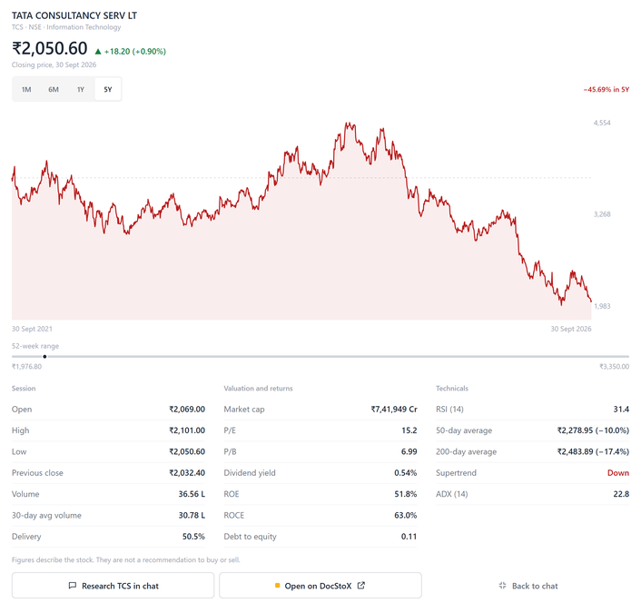
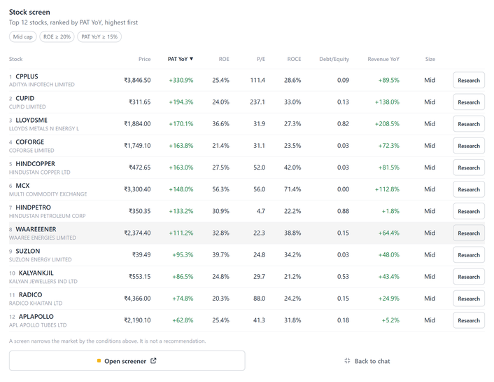
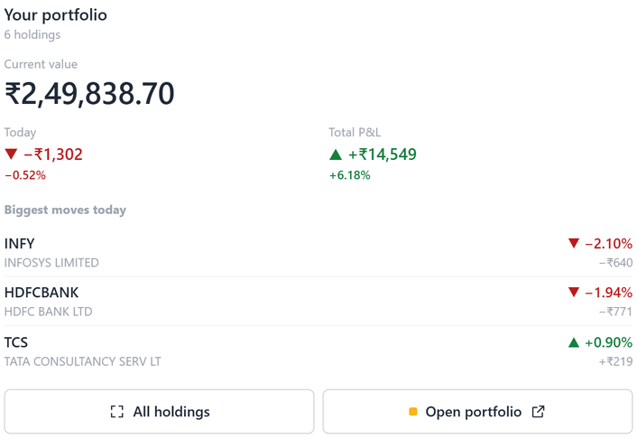

<h1 align="center">DocStoX: Indian Stock Market MCP Server for Claude, ChatGPT and Cursor</h1>

<p align="center">
  <strong>Ask your AI assistant about any NSE or BSE stock and get answers built on real Indian market data, not the model's memory.</strong>
</p>

<p align="center">
  <a href="LICENSE"></a>
  <a href="https://modelcontextprotocol.io"></a>
  
  
  <br>
  
  
  
  
  
</p>

**DocStoX** is an Indian stock market MCP server, available as a Claude plugin, a ChatGPT app and an extension for Codex and Gemini CLI. It connects your assistant, over the Model Context Protocol, to NSE and BSE data for every actively traded listed company: latest and historical prices, quarterly and annual fundamentals, shareholding, FII and DII flows, F&O and index options, a stock screener, IPOs, corporate actions, filings and market news. Use it for AI stock research in India, from a single company deep dive to a Nifty and Sensex market brief.

The plugin adds five research skills on top of the server, so your assistant knows which data to pull, in what order, and how to present it with units, as-of dates and plain-English explanations.


## Contents

- [What you can ask](#what-you-can-ask)
- [Install](#install-the-docstox-mcp-server)
- [Tools: Indian stock data by area](#tools-indian-stock-data-by-area)
- [Skills](#skills)
- [Plans and limits](#plans-and-limits)
- [Data and privacy](#data-and-privacy)
- [Disclaimer](#disclaimer)
- [Support](#support)

## What you can ask

**Research one company**

- "Research HDFC Bank: what it does, latest results, valuation and key risks."
- "How have Reliance's margins and debt changed over the last eight quarters?"
- "Who owns Tata Motors? Show the promoter, FII, DII and mutual fund holding trend."

**Compare stocks**

- "Compare TCS, Infosys and HCL Tech on revenue growth, margins, ROE and valuation."
- "Compare Maruti Suzuki and Tata Motors on sales growth, margins, debt and promoter holding."

**Screen the market**

- "Find Indian mid-caps with ROE above 20%, debt to equity below 0.5 and P/E under 30."
- "Which stocks are trading near their 52-week high with rising delivery volumes?"

**Follow the market**

- "Give me today's Indian market brief: Nifty, Sensex, sectors, FII and DII flows and top movers."
- "What are FIIs doing in the cash market and in index futures this week?"
- "Show the Nifty option chain with max pain, PCR and open interest build-up."
- "Which IPOs open this week, and what are GIFT Nifty, gold and crude doing?"

**Your own account**

- "How is my DocStoX portfolio doing today, and what news affects my holdings?"
- "Check my watchlist for results due this week."

In apps that support interactive views, stock quotes, screens and your portfolio also render as charts and tables inside the conversation.

**Stock deep dive**



**Market screener**



**Portfolio review**



## Install the DocStoX MCP server

The server is **`https://mcp.docstox.com/mcp`** (streamable HTTP). There is nothing to clone, build or run locally. Any app that supports remote MCP servers can use it.

When you connect, a browser window opens on docstox.com so you can sign in with Google or your DocStoX email and password, then allow read-only access. A free account is created if you do not have one. Apps that cannot open a browser sign-in use a personal API key from [docstox.com/mcp/keys](https://docstox.com/mcp/keys), sent as `Authorization: Bearer dox-...`.

### One-click installs

| Client | Install |
|---|---|
| VS Code (GitHub Copilot) | [Install in VS Code](https://vscode.dev/redirect/mcp/install?name=docstox&config=%7B%22type%22%3A%22http%22%2C%22url%22%3A%22https%3A//mcp.docstox.com/mcp%22%7D) |
| VS Code Insiders | [Install in VS Code Insiders](https://insiders.vscode.dev/redirect/mcp/install?name=docstox&config=%7B%22type%22%3A%22http%22%2C%22url%22%3A%22https%3A//mcp.docstox.com/mcp%22%7D&quality=insiders) |
| Cursor | [Add to Cursor](https://cursor.com/en/install-mcp?name=docstox&config=eyJ1cmwiOiJodHRwczovL21jcC5kb2NzdG94LmNvbS9tY3AifQ%3D%3D) |
| Kiro | [Add to Kiro](https://kiro.dev/launch/mcp/add?name=docstox&config=%7B%22url%22%3A%22https%3A//mcp.docstox.com/mcp%22%2C%22disabled%22%3Afalse%2C%22autoApprove%22%3A%5B%5D%7D) |

### Claude (claude.ai, Claude Desktop, Cowork)

Add DocStoX from the Claude directory, or upload this plugin under **Customize > Plugins > Add**, then connect DocStoX on the plugin's **Connectors** tab and sign in.

### ChatGPT

Add DocStoX from the ChatGPT apps directory, or follow the steps at [docstox.com/mcp](https://docstox.com/mcp).

### Claude Code

Install the plugin (server plus skills) from this repository's marketplace:

```bash
/plugin marketplace add thedocstox/docstox-plugin
/plugin install docstox@docstox
```

Or add only the server, then run `/mcp`, select **docstox** and choose **Authenticate**:

```bash
claude mcp add --transport http docstox https://mcp.docstox.com/mcp
```

### Codex

In the Codex app: **Customize > Plugins > Add > Add plugin marketplace**, source `thedocstox/docstox-plugin`, ref `main`.

In the Codex CLI, add the server and sign in:

```bash
codex mcp add docstox --url https://mcp.docstox.com/mcp
codex mcp login docstox
```

### Gemini CLI

```bash
gemini extensions install https://github.com/thedocstox/docstox-plugin
```

### Cursor

Use the **Add to Cursor** link above, open this deeplink in your browser, or add the JSON below to `~/.cursor/mcp.json`:

```text
cursor://anysphere.cursor-deeplink/mcp/install?name=docstox&config=eyJ1cmwiOiJodHRwczovL21jcC5kb2NzdG94LmNvbS9tY3AifQ%3D%3D
```

### Perplexity

Perplexity Pro, Max and Enterprise: **Settings > Connectors > Custom connector > Remote**, URL `https://mcp.docstox.com/mcp`, sign in with OAuth.

### Mistral Le Chat

**Connectors > Add connector > Custom MCP**, URL `https://mcp.docstox.com/mcp`, authentication with an API key (`Authorization: Bearer dox-...`).

### Manus

**Settings > Connectors > Custom MCP**, URL `https://mcp.docstox.com/mcp`, header `Authorization: Bearer dox-...`.

### Microsoft 365 Copilot

Build a declarative agent with the Microsoft 365 Agents Toolkit for VS Code: create a new **Declarative Agent**, choose **Add an Action > Start with an MCP Server**, enter `https://mcp.docstox.com/mcp` and select the DocStoX tools you want. Configure OAuth as described in Microsoft's guide, [Build plugins from an MCP server](https://learn.microsoft.com/en-us/microsoft-365-copilot/extensibility/build-mcp-plugins), then provision the agent and use it in Microsoft 365 Copilot.

### Cline, Windsurf, Goose, LM Studio, Zed, OpenCode and other MCP clients

Add this to the client's MCP settings. Field names vary slightly between clients (`url`, `serverUrl` or `httpUrl`):

```json
{
  "mcpServers": {
    "docstox": { "url": "https://mcp.docstox.com/mcp" }
  }
}
```

To use an API key instead of browser sign-in, add a header:

```json
"headers": { "Authorization": "Bearer dox-YOUR_KEY" }
```

Check the connection by calling the `read_me` tool. Step-by-step guides for every client: [docstox.com/docs/connect-your-ai/connect-coding-tools](https://docstox.com/docs/connect-your-ai/connect-coding-tools).

## Tools: Indian stock data by area

DocStoX exposes **93 read-only tools**. On the Free plan, 57 return full results, 6 market-wide scans return the first rows of their results, and 30 are part of DocStoX Pro. Calling a Pro tool on Free returns a short explanation of what it would add, and that call is not counted against your allowance. Every tool, with its parameters and plan, is listed at [docstox.com/mcp/tools](https://docstox.com/mcp/tools).

| Area | What it covers | Example tools |
|---|---|---|
| Discovery and prices | Symbol search, latest and historical NSE prices, trending stocks, Nifty, Sensex, GIFT Nifty, MCX gold, silver and crude, FX | `search_stocks`, `get_stock_quote`, `get_price_history`, `get_global_markets` |
| Research and valuation | One-call stock dossier, AI score with its factors, investment thesis, fair-value range, peer comparison | `get_stock_dossier`, `score_stock`, `get_valuation`, `get_peer_comparison` |
| Company fundamentals | Quarterly and annual financials, ratios, analyst estimates, filings, earnings calendar, corporate actions | `get_financials`, `get_screener_ratios`, `get_forecasts`, `get_documents` |
| Ownership, insiders and risk | Shareholding pattern, mutual fund holdings, insider and SAST trades, promoter pledges, ASM and GSM surveillance flags | `get_shareholding`, `get_mf_holdings`, `get_insider_trades`, `get_exchange_risk` |
| Stock screener | Screen every listed company on fundamentals and technicals with AND/OR filters | `screen_stocks`, `screen_advanced`, `list_screener_metrics` |
| Technicals and setups | Indicators, chart patterns, base and breakout setups | `get_technicals`, `get_stock_patterns`, `screen_patterns`, `get_recent_breakouts` |
| Themes and sectors | Thematic baskets and sector strength | `get_themes`, `get_theme_members`, `get_sector_scores` |
| News and events | Market and company news, verified events, earnings news and event impact | `get_market_brief`, `get_stock_news_feed`, `search_news`, `analyze_event_impact` |
| Market, flows and deals | Market breadth, FII DII flows, FPI sector flows, index valuations, bulk and block deals, delivery, F&O ban list, IPOs | `get_fii_dii_flows`, `market_valuations`, `market_deals`, `market_ipo` |
| Derivatives (F&O) | Index option chain, max pain, PCR trend, OI build-up, gamma exposure, India VIX | `get_option_chain`, `get_max_pain`, `get_oi_buildup`, `get_india_vix` |
| Your account | Your own DocStoX portfolio and watchlist | `get_user_portfolio`, `get_user_watchlist` |

Symbols are NSE tickers such as `RELIANCE`, `TCS` or `HDFCBANK`. Amounts are in Indian rupees; market capitalisation and flows are in rupees crore.

## Skills

The plugin's skills are Markdown instructions in [`skills/`](skills) that guide the assistant through a research workflow. They fall back to free tools when a Pro tool is not available on your plan.

| Skill | Use it to |
|---|---|
| [`research-stock`](skills/research-stock/SKILL.md) | Research one NSE or BSE company in depth: business, results, valuation, ownership and risks |
| [`compare-stocks`](skills/compare-stocks/SKILL.md) | Put two to ten companies side by side on the same measures, as of the same date |
| [`screen-the-market`](skills/screen-the-market/SKILL.md) | Turn an idea into explicit screening conditions and explain why each result qualified |
| [`review-portfolio`](skills/review-portfolio/SKILL.md) | Check up on your own DocStoX holdings or watchlist: moves, concentration, news and results due |
| [`market-brief`](skills/market-brief/SKILL.md) | Write a short, dated Indian market brief: indices, sectors, flows, movers, commodities and news |

## Plans and limits

|  | Free | Pro |
|---|---|---|
| Tool calls per day | 50 | 5,000 |
| Tool calls per rolling 30 days | 1,000 | No separate cap |
| Tools | 57 in full, 6 with first rows | All 93 |

The daily count resets at 00:00 UTC (05:30 IST). The `read_me` guide and calls to a Pro tool while on Free are never counted. Your usage is shown at [docstox.com/mcp/keys](https://docstox.com/mcp/keys). Plan details: [docstox.com/pricing](https://docstox.com/pricing?utm_source=github&utm_medium=readme).

## Data and privacy

- **What the plugin contains:** skills (Markdown instructions) and a reference to one remote server, `https://mcp.docstox.com/mcp`. It runs no code on your computer and stores nothing itself.
- **What is sent:** when your assistant uses DocStoX, it sends the tool name and its inputs (for example a stock symbol or screening conditions) to `mcp.docstox.com`, authenticated with your DocStoX sign-in. Your conversation, other chats, files and memory are not sent.
- **What DocStoX records:** usage per account (which tool, when, and whether it succeeded) to apply your plan's limits and show you your usage at https://docstox.com/mcp/keys. You can revoke a connected app there at any time.
- **Read-only:** every DocStoX tool reads data. The plugin cannot place trades, move money, or change your portfolio, watchlist or account.

Full policy: https://docstox.com/privacy. Terms: https://docstox.com/terms.

## Disclaimer

DocStoX provides market data and research tools for information only. Nothing produced with this plugin is investment advice. Please consult a SEBI-registered advisor before investing.

## Support

- Documentation: https://docstox.com/docs/connect-your-ai/mcp-overview
- Usage and limits: https://docstox.com/docs/connect-your-ai/usage-and-limits
- Email: support@docstox.com
- Issues with this plugin: [GitHub issues](https://github.com/thedocstox/docstox-plugin/issues)

## License

The contents of this repository (skills, manifests and documentation) are released under the [MIT License](LICENSE). Use of the DocStoX service is governed by the DocStoX terms at https://docstox.com/terms.
