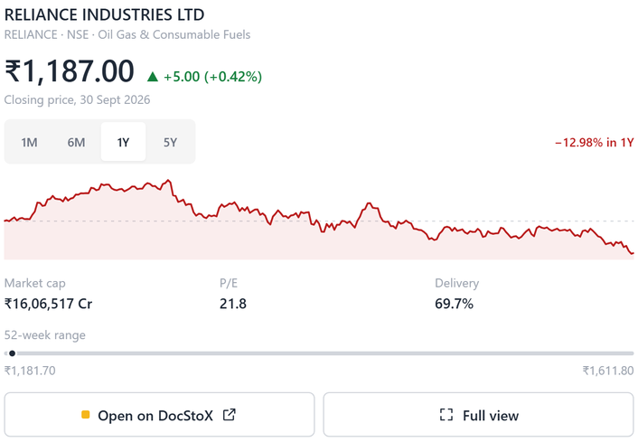

# DocStoX for Claude and ChatGPT

Research Indian stocks with your AI assistant, using real NSE and BSE data instead of the model's memory.

DocStoX is an equity research platform covering every actively traded company on the National Stock Exchange and the Bombay Stock Exchange. This plugin connects your assistant to the DocStoX connector (a remote MCP server) and adds skills that teach it how to research Indian stocks well: which data to pull, in what order, and how to present it with units, dates and plain-English explanations.



## What you can do

- **Research a company**: business, latest quarterly and annual results, margins, debt, valuation against its sector, promoter and institutional ownership, risks and upcoming events.
- **Compare stocks**: put TCS, Infosys and HCL Tech (or any set of companies) side by side on growth, profitability, valuation and ownership.
- **Screen the market**: find companies that match your conditions, such as mid-caps with ROE above 20% and low debt, and see why each one qualified.
- **Review your portfolio**: a check-up of your own DocStoX holdings or watchlist: today's moves, concentration, news and results due.
- **Get a market brief**: Nifty and Sensex, sectors, FII and DII flows, top movers with the news behind them, GIFT Nifty, crude, gold and the rupee.

In apps that support interactive views, stock quotes, screens and your portfolio also appear as charts and tables inside the conversation.

## Example prompts

- "Research HDFC Bank: what it does, latest results, valuation and key risks."
- "Compare TCS, Infosys and HCL Tech on revenue growth, margins, ROE and valuation."
- "Find Indian mid-caps with ROE above 20%, debt to equity below 0.5 and P/E under 30."
- "How is my DocStoX portfolio doing today?"
- "Give me today's Indian market brief."

## Install

**Claude (claude.ai, Claude Desktop, Cowork):** add DocStoX from the Claude directory, or upload this plugin under **Customize > Plugins > Add**. Then open the plugin's **Connectors** tab and connect DocStoX.

**Claude Code:**

```bash
/plugin marketplace add docstox/docstox-plugin
/plugin install docstox@docstox
```

**ChatGPT and Codex:** add DocStoX from the ChatGPT apps directory, or follow the steps at https://docstox.com/mcp.

When you connect, you are sent to docstox.com to sign in with Google or with your DocStoX email and password, then asked to allow read-only access. A free account is created if you do not have one.

## Plans and limits

A free DocStoX account includes 50 tool calls a day (1,000 per rolling 30 days) and covers prices, financials, ownership, news, market data and your own portfolio. DocStoX Pro raises the limit to 5,000 calls a day and adds research tools such as the full stock dossier, fair value, the AI score, market-wide screens and options analytics. The skills fall back to free tools when a Pro tool is not available on your plan. See https://docstox.com/pricing.

## Data and privacy

- **What the plugin contains:** skills (Markdown instructions) and a reference to one remote server, `https://mcp.docstox.com/mcp`. It runs no code on your computer and stores nothing itself.
- **What is sent:** when your assistant uses DocStoX, it sends the tool name and its inputs (for example a stock symbol or screening conditions) to `mcp.docstox.com`, authenticated with your DocStoX sign-in. Your conversation, other chats, files and memory are not sent.
- **What DocStoX records:** usage per account (which tool, when, and whether it succeeded) to apply your plan's limits and show you your usage at https://docstox.com/mcp/keys. You can revoke a connected app there at any time.
- **Read-only:** every DocStoX tool reads data. The plugin cannot place trades, move money, or change your portfolio, watchlist or account.

Full policy: https://docstox.com/privacy. Terms: https://docstox.com/terms.

## Disclaimer

DocStoX provides market data and research tools for information only. Nothing produced with this plugin is investment advice. Please consult a SEBI-registered advisor before investing.

## Support

Documentation: https://docstox.com/docs/connect-your-ai/mcp-overview
Email: support@docstox.com

## License

The contents of this repository (skills, manifests and documentation) are released under the MIT License. Use of the DocStoX service is governed by the DocStoX terms at https://docstox.com/terms.
